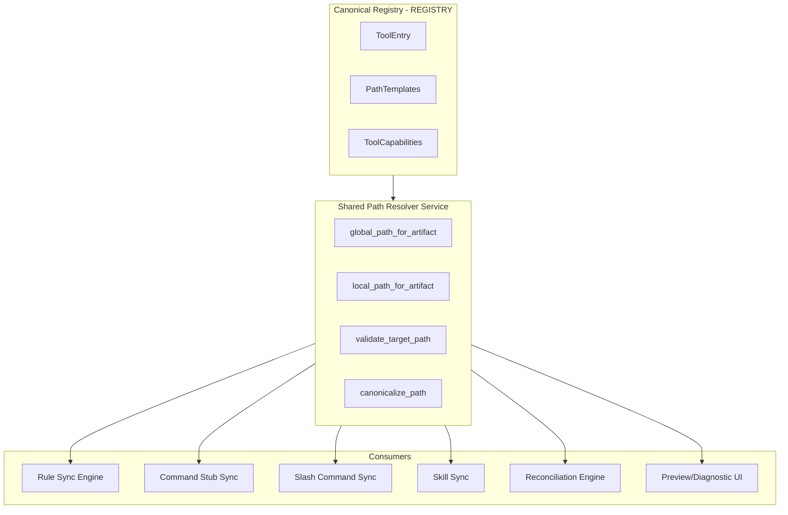

# Project Strategy: Path Resolution Invariants (#41) & Reconciliation Engine (#39)

## Executive Summary

This plan addresses two interconnected issues that are foundational to RuleWeaver's reliability:

1. **Issue #41 - Path Resolution Invariants**: Standardize path resolution across all artifact types (rules, command stubs, slash commands, skills) so that preview, sync, cleanup, and reconciliation flows produce identical paths.

2. **Issue #39 - Reconciliation Engine**: Build a desired-state reconciliation system that automatically cleans up stale artifacts when rules/commands/skills are renamed, deleted, or retargeted.

These issues are tightly coupled because reliable reconciliation depends on consistent path resolution.

---

## 1. High-Level Strategy

### Current State Analysis

The codebase already has a partial canonical registry in [`src-tauri/src/models/registry.rs`](src-tauri/src/models/registry.rs:1) that defines:

- Tool capabilities (rules, command stubs, slash commands, skills support)
- Path templates for global/local targets
- File format metadata

However, path resolution logic is **scattered across multiple modules**:

| Module                                                                      | Current Responsibility                                        |
| --------------------------------------------------------------------------- | ------------------------------------------------------------- |
| [`sync/mod.rs`](src-tauri/src/sync/mod.rs:29)                               | `resolve_registry_path()`, `validate_target_path()` for rules |
| [`slash_commands/mod.rs`](src-tauri/src/slash_commands/mod.rs:27)           | `get_command_path()`, `get_command_path_for_root()`           |
| [`slash_commands/adapters.rs`](src-tauri/src/slash_commands/adapters.rs:70) | `global_dir()`, `local_dir()` per adapter                     |
| [`commands/adapters.rs`](src-tauri/src/commands/adapters.rs:1)              | Command stub formatting (no path resolution)                  |

This fragmentation causes:

- **Preview vs write path mismatches**
- **Inconsistent local target validation**
- **Stale artifacts after mutations**
- **Duplicated logic that drifts over time**

### Target Architecture



### Key Design Principles

1. **Single Source of Truth**: All path templates live in `REGISTRY`. No hardcoded paths elsewhere.
2. **Pure Functions**: Path resolution functions are deterministic and testable with fixture-based matrix tests.
3. **Artifact-Agnostic**: The resolver handles all artifact types uniformly via `ArtifactType` enum.
4. **Idempotent Reconciliation**: Safe to run multiple times; produces same result.
5. **Dry-Run First**: All reconciliation operations support preview mode.

---

## 2. Implementation Plan

### Phase 1: Shared Path Resolver Service

**Goal**: Create a unified path resolution module that all sync engines consume.

#### 1.1 Create `path_resolver` Module

Create [`src-tauri/src/path_resolver/mod.rs`](src-tauri/src/path_resolver/mod.rs:1) with:

```rust
/// Resolved path information for an artifact
pub struct ResolvedPath {
    pub path: PathBuf,
    pub adapter: AdapterType,
    pub artifact: ArtifactType,
    pub scope: Scope,
    pub exists: bool,
}

/// Shared path resolver service
pub struct PathResolver {
    home_dir: PathBuf,
    repository_roots: Vec<PathBuf>,
}

impl PathResolver {
    /// Resolve global path for artifact+adapter combination
    pub fn global_path(&self, adapter: AdapterType, artifact: ArtifactType) -> Result<ResolvedPath>;

    /// Resolve local path for artifact+adapter+repository_root combination
    pub fn local_path(&self, adapter: AdapterType, artifact: ArtifactType, repo_root: &Path) -> Result<ResolvedPath>;

    /// Validate a user-provided target path
    pub fn validate_target_path(&self, path: &Path) -> Result<()>;

    /// Canonicalize path with platform-specific normalization
    pub fn canonicalize(&self, path: &Path) -> Result<PathBuf>;

    /// List all paths that would be written for given artifacts
    pub fn preview_paths(&self, artifacts: &[ArtifactSpec]) -> Result<Vec<ResolvedPath>>;
}
```

#### 1.2 Path Template Resolution Logic

The resolver must handle path templates from the registry:

| Artifact Type | Global Path Template             | Local Path Template                   |
| ------------- | -------------------------------- | ------------------------------------- |
| Rule          | `~/.claude/CLAUDE.md`            | `{repo}/.claude/CLAUDE.md`            |
| CommandStub   | `~/.claude/commands/COMMANDS.md` | `{repo}/.claude/commands/COMMANDS.md` |
| SlashCommand  | `~/.claude/commands/{name}.md`   | `{repo}/.claude/commands/{name}.md`   |
| Skill         | TBD (Phase 3)                    | TBD (Phase 3)                         |

#### 1.3 Migrate Existing Call Sites

Replace scattered path resolution with `PathResolver` calls:

- [`sync/mod.rs:resolve_registry_path()`](src-tauri/src/sync/mod.rs:29) → `PathResolver::global_path()`
- [`sync/mod.rs:validate_target_path()`](src-tauri/src/sync/mod.rs:40) → `PathResolver::validate_target_path()`
- [`slash_commands/mod.rs:get_command_path()`](src-tauri/src/slash_commands/mod.rs:27) → `PathResolver::global_path()` / `local_path()`

#### 1.4 Test Matrix

Create comprehensive tests in [`src-tauri/src/path_resolver/tests.rs`](src-tauri/src/path_resolver/tests.rs:1):

```
Test Matrix: adapter × artifact × scope × platform
- 10 adapters × 4 artifacts × 2 scopes × 2 platforms = 160 test cases
- Plus edge cases: Unicode paths, symlinks, missing directories
```

---

### Phase 2: Reconciliation Engine

**Goal**: Build desired-state reconciliation that runs after CRUD mutations.

#### 2.1 Desired State Model

Create [`src-tauri/src/reconciliation/mod.rs`](src-tauri/src/reconciliation/mod.rs:1):

```rust
/// Represents the desired state of generated artifacts
pub struct DesiredState {
    /// All paths that should exist with their expected content hashes
    expected_paths: HashMap<PathBuf, ExpectedArtifact>,
}

/// An artifact that should exist
pub struct ExpectedArtifact {
    pub adapter: AdapterType,
    pub artifact: ArtifactType,
    pub scope: Scope,
    pub repo_root: Option<PathBuf>,
    pub content_hash: String,
}

/// Represents actual filesystem state
pub struct ActualState {
    /// All generated artifacts currently on disk
    found_paths: HashMap<PathBuf, FoundArtifact>,
}

/// Reconciliation plan
pub struct ReconcilePlan {
    pub to_create: Vec<ResolvedPath>,
    pub to_update: Vec<ResolvedPath>,
    pub to_remove: Vec<PathBuf>,
    pub unchanged: Vec<PathBuf>,
}
```

#### 2.2 Reconciliation Operations

```rust
pub struct ReconciliationEngine {
    db: Arc<Database>,
    path_resolver: Arc<PathResolver>,
}

impl ReconciliationEngine {
    /// Compute desired state from database artifacts
    pub async fn compute_desired_state(&self) -> Result<DesiredState>;

    /// Scan filesystem for actual state
    pub async fn scan_actual_state(&self) -> Result<ActualState>;

    /// Compare desired vs actual to produce plan
    pub fn plan(&self, desired: &DesiredState, actual: &ActualState) -> ReconcilePlan;

    /// Execute reconciliation plan (dry-run or real)
    pub async fn execute(&self, plan: &ReconcilePlan, dry_run: bool) -> Result<ReconcileResult>;

    /// Full reconciliation in one call
    pub async fn reconcile(&self, dry_run: bool) -> Result<ReconcileResult>;
}
```

#### 2.3 Reconciliation Triggers

Wire reconciliation into mutation handlers:

| Trigger                      | When to Reconcile      |
| ---------------------------- | ---------------------- |
| Rule Create/Update/Delete    | After database commit  |
| Rule Adapter Toggle          | After database commit  |
| Rule Scope Change            | After database commit  |
| Command Create/Update/Delete | After database commit  |
| Command Target Path Change   | After database commit  |
| Import Operation             | After import completes |
| Adapter Enable/Disable       | After settings change  |

#### 2.4 Stale Artifact Detection

The engine must detect artifacts that are:

1. **Orphaned**: Generated file exists but no artifact references it
2. **Outdated**: Content hash mismatch between expected and actual
3. **Wrong Location**: File exists at old path after rename/retarget

#### 2.5 Audit Logging

All reconciliation operations must log:

```rust
pub struct ReconcileLogEntry {
    pub timestamp: DateTime<Utc>,
    pub operation: ReconcileOperation,
    pub artifact_type: ArtifactType,
    pub adapter: AdapterType,
    pub scope: Scope,
    pub path: PathBuf,
    pub result: ReconcileResult,
}
```

---

### Phase 3: Integration & Migration

**Goal**: Integrate resolver and reconciliation into existing flows.

#### 3.1 Update Sync Engines

Replace direct path manipulation in:

- [`SyncEngine`](src-tauri/src/sync/mod.rs:532) - Use `PathResolver`
- [`SlashCommandSyncEngine`](src-tauri/src/slash_commands/sync.rs:137) - Use `PathResolver`
- Command stub sync (where applicable)

#### 3.2 Add Reconciliation to CRUD Handlers

Update Tauri command handlers:

- [`rule_commands.rs`](src-tauri/src/commands/rule_commands.rs:1) - Trigger reconciliation after mutations
- [`command_commands.rs`](src-tauri/src/commands/command_commands.rs:1) - Trigger reconciliation after mutations
- [`skill_commands.rs`](src-tauri/src/commands/skill_commands.rs:1) - Trigger reconciliation after mutations

#### 3.3 Frontend Integration

Expose reconciliation endpoints to frontend:

```typescript
// New Tauri commands
invoke('preview_reconciliation'): Promise<ReconcilePlan>
invoke('execute_reconciliation', { dryRun: boolean }): Promise<ReconcileResult>
invoke('get_artifact_status'): Promise<ArtifactStatus[]>
```

#### 3.4 Migration Path

For existing installations:

1. Run reconciliation on first launch after upgrade
2. Log any stale artifacts found
3. Offer "Repair All" action in settings

---

### Phase 4: Testing & Documentation

**Goal**: Comprehensive test coverage and updated documentation.

#### 4.1 Unit Tests

- `path_resolver` tests: Full adapter × artifact × scope matrix
- `reconciliation` tests: Desired state computation, plan generation, execution

#### 4.2 Integration Tests

- End-to-end reconciliation after rule mutations
- Cross-platform path handling (Windows/Unix)
- Idempotency verification

#### 4.3 Documentation Updates

- Update [`architecture.md`](architecture.md:1) with new modules
- Update [`docs/ai-tools-commands-reference.md`](docs/ai-tools-commands-reference.md:1) if needed
- Add troubleshooting guide for reconciliation issues

---

## 3. Execution Checklist

### Phase 1: Shared Path Resolver Service

- [ ] Create feature branch `feature/path-resolution-reconciliation`
- [ ] Create `src-tauri/src/path_resolver/mod.rs` with `PathResolver` struct
- [ ] Implement `global_path()` using registry templates
- [ ] Implement `local_path()` with repository root substitution
- [ ] Implement `validate_target_path()` with home directory constraint
- [ ] Implement `canonicalize()` with platform normalization
- [ ] Implement `preview_paths()` for UI consumption
- [ ] Create `src-tauri/src/path_resolver/tests.rs` with matrix tests
- [ ] Migrate `sync/mod.rs` to use `PathResolver`
- [ ] Migrate `slash_commands/mod.rs` to use `PathResolver`
- [ ] Migrate `slash_commands/adapters.rs` to use `PathResolver`
- [ ] Remove deprecated path functions from sync module
- [ ] Run full test suite and fix regressions

### Phase 2: Reconciliation Engine

- [ ] Create `src-tauri/src/reconciliation/mod.rs`
- [ ] Define `DesiredState`, `ActualState`, `ReconcilePlan` structs
- [ ] Implement `compute_desired_state()` from database
- [ ] Implement `scan_actual_state()` filesystem scanner
- [ ] Implement `plan()` comparison logic
- [ ] Implement `execute()` with dry-run support
- [ ] Create `src-tauri/src/reconciliation/tests.rs`
- [ ] Add audit logging for all operations
- [ ] Create `ReconcileLogEntry` database table

### Phase 3: Integration & Migration

- [ ] Wire `PathResolver` into `SyncEngine`
- [ ] Wire `PathResolver` into `SlashCommandSyncEngine`
- [ ] Add reconciliation triggers to rule CRUD handlers
- [ ] Add reconciliation triggers to command CRUD handlers
- [ ] Add reconciliation triggers to skill CRUD handlers
- [ ] Add reconciliation after import operations
- [ ] Create `preview_reconciliation` Tauri command
- [ ] Create `execute_reconciliation` Tauri command
- [ ] Create `get_artifact_status` Tauri command
- [ ] Add frontend UI for reconciliation status/repair

### Phase 4: Testing & Documentation

- [ ] Add unit tests for path resolver matrix (160+ cases)
- [ ] Add unit tests for reconciliation engine
- [ ] Add integration tests for mutation-triggered reconciliation
- [ ] Add cross-platform path tests (Windows/Unix)
- [ ] Verify idempotency with repeated reconciliation runs
- [ ] Update `architecture.md` with new modules
- [ ] Update developer documentation
- [ ] Create user-facing troubleshooting guide
- [ ] Run full regression test suite
- [ ] Create PR with linked issues #41 and #39

---

## 4. Dependency Graph

```mermaid
flowchart LR
    subgraph Phase1[Phase 1: Path Resolver]
        PR[PathResolver Module]
        PM[Path Migration]
        PT[Path Tests]
    end

    subgraph Phase2[Phase 2: Reconciliation]
        RE[Reconciliation Engine]
        RL[Reconciliation Logging]
        RT[Reconciliation Tests]
    end

    subgraph Phase3[Phase 3: Integration]
        SI[Sync Integration]
        CH[CRUD Handlers]
        FE[Frontend UI]
    end

    subgraph Phase4[Phase 4: Testing & Docs]
        IT[Integration Tests]
        DC[Documentation]
    end

    PR --> PM --> PT
    PT --> RE
    RE --> RL --> RT
    RT --> SI
    SI --> CH --> FE
    FE --> IT --> DC
```



---

## 5. Risk Mitigation

| Risk                                        | Mitigation                                             |
| ------------------------------------------- | ------------------------------------------------------ |
| Path resolution changes break existing sync | Comprehensive test matrix before migration             |
| Reconciliation deletes wrong files          | Dry-run by default; require explicit confirmation      |
| Performance impact of filesystem scanning   | Incremental reconciliation; cache actual state         |
| Cross-platform path issues                  | Platform-specific test fixtures; CI on Windows + Linux |
| Migration leaves stale files                | One-time repair action in settings                     |

---

## 6. Success Criteria

### Issue #41 Acceptance Criteria

- [x] Preview and actual write paths always match for rules/commands/slash/skills
- [x] Local target validation is consistent across all artifact editors and APIs
- [x] Tests cover full adapter × artifact × scope matrix with platform-specific path cases
- [x] No stale files remain from resolver mismatch after migration

### Issue #39 Acceptance Criteria

- [x] Rename/delete/deselect operations remove stale generated artifacts deterministically
- [x] Reconciliation runs after artifact mutations and import/export flows
- [x] Dry-run output is available and matches actual reconcile execution
- [x] Audit logs capture created/updated/removed artifacts with adapter/scope context
